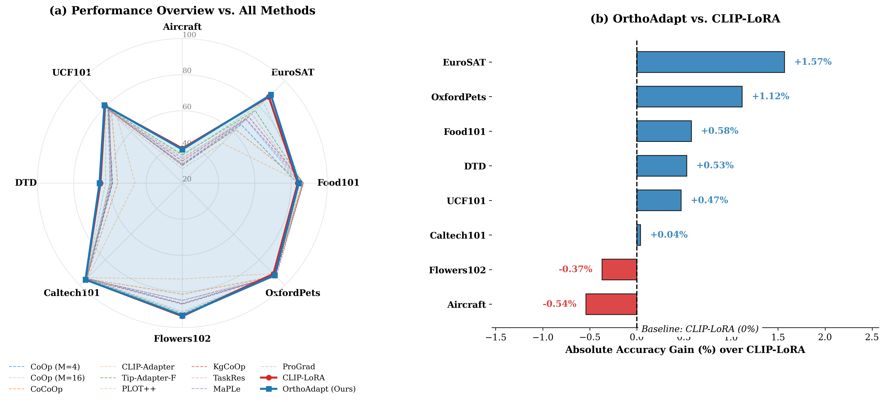

# OrthoAdapt / CLIP-SingLoRA

Research code for few-shot CLIP adaptation with `LoRA`, `SingLoRA`, gated multi-head adapters, and the orthogonally regularized variant.

This repository is no longer just a minimal training script. It now contains:

- the main PEFT training pipeline for CLIP,
- multiple adapter variants exposed through one CLI,
- ablation scripts for head count, rank, orthogonal regularization, and loss functions,
- robustness evaluation under synthetic corruptions,
- visualization utilities for gating specialization and singular value spectra,
- saved figures and result folders used to support the paper narrative.


_Figure: 4-shot summary from `visualize_combined_result.py`, comparing paper-reported OrthoAdapt results against CLIP-LoRA and prior few-shot CLIP adaptation baselines._

## What this repo implements

The naming in the codebase is slightly different from the naming in the paper. The table below is the easiest way to map paper terminology to runnable commands.

| Paper / concept | CLI flag | Main implementation | Notes |
| --- | --- | --- | --- |
| Standard LoRA / CLIP-LoRA baseline | `--adapter lora` | `loralib/layers.py`, `apply_lora()` | Baseline low-rank adaptation with asymmetric `BA` factorization |
| SingLoRA | `--adapter singlora` | `LinearSingLoRA` | Symmetric single-matrix update for more stable optimization |
| Gated multi-head SingLoRA | `--adapter gmhsinglora` | `LinearGMHSingLoRA` | Multi-head gated variant without explicit orthogonal penalty |
| OrthoAdapt (ours) | `--adapter ohsinglora` | `LinearOHsingLoRA` | Multi-head symmetric adapter with gating and orthogonal regularization via `--lambda_o` |

In practice, `ohsinglora` is the code path that corresponds most closely to the OrthoAdapt method described in `OrthoAdapt_v2.pdf`.

## Repository map

| Path | Purpose |
| --- | --- |
| `main.py` | Entry point for training and evaluation |
| `lora.py` | Training loop, loss assembly, evaluation, checkpoint save/load |
| `run_utils.py` | CLI arguments and reproducibility utilities |
| `loralib/` | Adapter implementations and helper functions |
| `datasets/` | Dataset wrappers and few-shot splits |
| `losses/` | Auxiliary objectives: ArcFace, CosFace, Center Loss, Focal Loss, Max-Entropy |
| `run_all.sh` | Small benchmark sweep with a fixed OrthoAdapt configuration |
| `scan_head.sh` | Rank/head ablation sweep across 1/4/16-shot settings |
| `scan_NumHead.sh` | Older head-count scan script for 4-shot experiments |
| `scan_loss.sh` | Loss-function ablation sweep |
| `eval_robustness.py` | Corruption robustness evaluation for saved checkpoints |
| `visualize_gating.py` | Head specialization / gating visualization |
| `analyze_spectrum.py` | Singular value spectrum analysis for LoRA vs OrthoAdapt |
| `visualize_combined_result.py` | Recreates the combined 4-shot summary figure in `img/` |
| `DATASETS.md` | Dataset preparation instructions and expected folder structure |

## Supported datasets

The codebase currently supports the following dataset IDs:

`caltech101`, `dtd`, `eurosat`, `fgvc`, `food101`, `imagenet`, `oxford_flowers`, `oxford_pets`, `stanford_cars`, `sun397`, `ucf101`

The paper experiments focus on eight few-shot benchmarks:

- `fgvc` (FGVC Aircraft)
- `eurosat`
- `food101`
- `oxford_pets`
- `oxford_flowers` (Flowers102)
- `caltech101`
- `dtd`
- `ucf101`

See [DATASETS.md](DATASETS.md) for the expected directory layout and download links.

## Environment setup

This repo assumes a CUDA-capable PyTorch environment and stores a local copy of the CLIP code under `clip/`.

1. Install a PyTorch + `torchvision` build that matches your CUDA setup.
2. Install the repo requirements:

```bash
pip install -r requirements.txt
pip install numpy matplotlib seaborn pillow
```

Notes:

- `requirements.txt` does not install `torch`, `torchvision`, `matplotlib`, `seaborn`, or `Pillow`, but the training and visualization scripts depend on them.
- If the CLI fails early with `ModuleNotFoundError: ftfy`, install the requirements first. The local CLIP tokenizer depends on it.
- The bash scripts were written for Linux/Colab-style environments and use `python3` plus hard-coded paths such as `/root/DATA`. If you are on Windows, run the Python commands directly or use WSL/Git Bash after editing the paths.

## Recommended paper-style setting

The scripts in this repo most often use the following configuration for the main OrthoAdapt run:

| Hyperparameter | Typical value |
| --- | --- |
| Backbone | `ViT-B/16` |
| Adapter | `ohsinglora` |
| Rank | `r=2` |
| Head count | `num_heads=2` |
| Orthogonal loss | `lambda_o=0.03` |
| Learning rate | `2e-4` |
| Batch size | `32` |
| Base iterations | `500` |
| Ramp-up steps | `100` |
| Adapted projections | `q k v` |
| Position | `all` |
| Encoder | `both` |

Important implementation detail: the actual optimization budget is `n_iters * shots`, as defined in `lora.py`.

## Quick start

### 1. Train OrthoAdapt

```bash
python main.py \
  --dataset eurosat \
  --root_path /path/to/DATA \
  --shots 4 \
  --backbone ViT-B/16 \
  --adapter ohsinglora \
  --r 2 \
  --alpha 1 \
  --num_heads 2 \
  --lambda_o 0.03 \
  --lr 2e-4 \
  --n_iters 500 \
  --batch_size 32 \
  --ramp_up_steps 100 \
  --params q k v \
  --position all \
  --encoder both \
  --save_path ./checkpoints
```

### 2. Train the CLIP-LoRA baseline

```bash
python main.py \
  --dataset eurosat \
  --root_path /path/to/DATA \
  --shots 4 \
  --backbone ViT-B/16 \
  --adapter lora \
  --r 2 \
  --alpha 1 \
  --lr 2e-4 \
  --n_iters 500 \
  --batch_size 32 \
  --params q k v \
  --position all \
  --encoder both \
  --save_path ./checkpoints
```

### 3. Evaluate a saved checkpoint only

```bash
python main.py \
  --dataset eurosat \
  --root_path /path/to/DATA \
  --shots 4 \
  --backbone ViT-B/16 \
  --adapter ohsinglora \
  --r 2 \
  --alpha 1 \
  --num_heads 2 \
  --lambda_o 0.03 \
  --params q k v \
  --position all \
  --encoder both \
  --save_path ./checkpoints \
  --eval_only
```

## Experiment scripts

### Batch sweeps

- `bash run_all.sh`
  Runs a compact OrthoAdapt sweep for the datasets listed inside the script.
- `bash scan_head.sh`
  Scans multiple `(rank, head count)` configurations across `1`, `4`, and `16` shots.
- `bash scan_loss.sh`
  Compares different loss functions such as `ce`, `ce_ls`, `arcface`, `cosface`, `ce_center`, `ce_maxent`, and `focal`.
- `bash scan_NumHead.sh`
  Older head-count scan script kept for reference.

All of these scripts write logs and CSV summaries into result folders such as `result_scan_head/`, `result_scan_loss/`, and `results_ablation_heads_lambda/`.

### Analysis and visualization

Evaluate corruption robustness:

```bash
python eval_robustness.py \
  --dataset eurosat \
  --root_path /path/to/DATA \
  --shots 4 \
  --backbone ViT-B/16 \
  --adapter ohsinglora \
  --checkpoint ./checkpoints/ohsinglora/ViT-B16/eurosat/4shots/seed1/adapter_weights.pt \
  --r 2 \
  --alpha 1 \
  --num_heads 2 \
  --position all \
  --encoder both \
  --params q k v
```

Visualize head specialization:

```bash
python visualize_gating.py \
  --checkpoint ./checkpoints/ohsinglora/ViT-B16/eurosat/4shots/seed1/adapter_weights.pt \
  --data_root /path/to/DATA/eurosat/2750 \
  --class_a Forest \
  --class_b Highway \
  --num_imgs 20 \
  --layer_idx 11 \
  --r 2 \
  --alpha 1 \
  --num_heads 2
```

Compare singular value spectra:

```bash
python analyze_spectrum.py \
  --lora_path ./path/to/lora_checkpoint.pt \
  --oh_path ./path/to/ohsinglora_checkpoint.pt \
  --layer_idx 11 \
  --param q_proj \
  --top_k 50
```

Recreate the combined 4-shot figure:

```bash
python visualize_combined_result.py
```

## 4-shot result snapshot

According to the paper draft and the values hard-coded in `visualize_combined_result.py`, OrthoAdapt improves over CLIP-LoRA on 6 out of 8 reported datasets in the 4-shot setting.

| Dataset | CLIP-LoRA | OrthoAdapt | Delta |
| --- | ---: | ---: | ---: |
| Aircraft | 39.15 | 38.61 | -0.54 |
| EuroSAT | 87.49 | 89.06 | +1.57 |
| Food101 | 83.72 | 84.30 | +0.58 |
| OxfordPets | 91.06 | 92.18 | +1.12 |
| Flowers102 | 93.67 | 93.30 | -0.37 |
| Caltech101 | 95.58 | 95.62 | +0.04 |
| DTD | 65.19 | 65.72 | +0.53 |
| UCF101 | 80.39 | 80.86 | +0.47 |
| Average | 79.53 | 79.96 | +0.43 |

The strongest gains appear on domain-shifted or structurally diverse datasets, especially EuroSAT and OxfordPets. This matches the paper's main claim that orthogonal gating improves expressiveness and robustness while preserving a small parameter budget.

## Paper and notes

- Dataset setup guide: [DATASETS.md](DATASETS.md)
- Core training entry point: [main.py](main.py)
- Adapter internals: [loralib/utils.py](loralib/utils.py) and [loralib/layers_OH_singlora.py](loralib/layers_OH_singlora.py)

## License

This repository is distributed under the terms of the [LICENSE](LICENSE) file.
